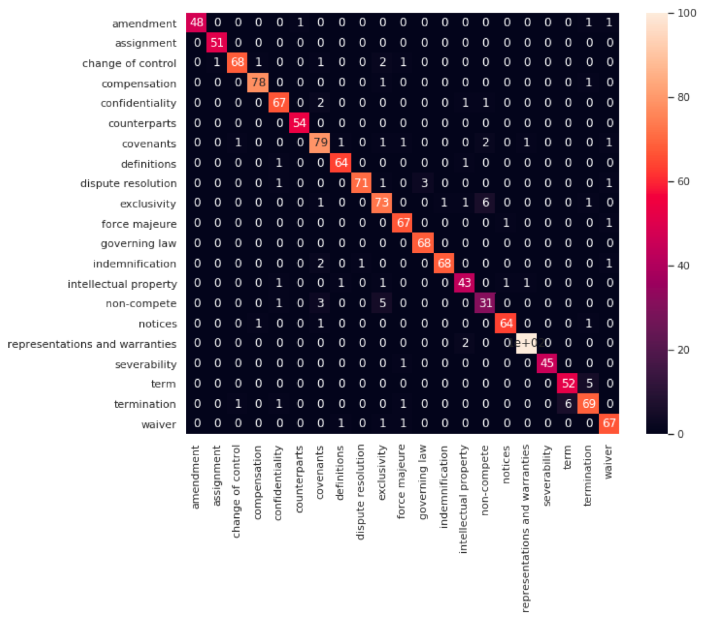

# Legal Clause Classification
RNN based Multi Class Classification of legal clauses

## Background: 
Why do we need LCC?

Document review and a Legal AI Engine.

Recent developments in the field of Natural Language Inferencing (NLI), Understanding (NLU) and Generation (NLG) have opened potential opportunities to explore plethora or rich text information generated by domain experts for past several decades and made digitally accessible. 

Legal domain is one such field where legal experts rely on the legal interpretation of text and also refer to similar precedents in legal documents. Hence, a data driven approach has potential to augment document discovery and information retrieval process by providing context aware outputs. While, fully automated legal services are far off in future, there are plenty of repetitive and mundane tasks, when automated can provide a boost to legal workflow. 

In this work, I have focused on legal tasks related to contract abstraction and review process. In this paper, I have applied a Bi-directional LSTM neural network to classify the various legal clauses in order to augment the contract review process. While, baseline models (Random Forrest) with hand-generated features were able to achieve ~80% accuracy they still suffered with model generalization issues, when the input clause text is shorter or a sentence by sentence prediction is required. On the other hand, flexibility of tuning Bias and Variance together allowed an LSTM based Neural Network to reach ~95% accuracy on validation sets with much better model generalization. 

In this work, first a transfer learning based “Legal Language Model” was fine-tuned on Legal Corpora and the encoder from this model was subsequently trained for classification task. Such language model training provides inapplicable text generation; however training for this task provides enriched representation of legal vocabulary for further downstream tasks. Moreover, in this paper we provide evidence that a multi-layer representation extracted from this fine-tuned encoder is much more efficient (than pre-trained word vectors) for automating the process of culling out the specifics of a contract including relevant dates, clauses and pertinent information regarding parties, which are necessary for contract abstraction and helps automate part of document management lifecycle. 

## Model:
- Baseline: Logistic Regression, Random Forrest
- Deep Learning: AWD-LSTM 

## Accuracy Metric

### Training Set

### Validation Set

## Inference:

## Integration in final product
For a demo of the product driven by this model please visit [Smriti.ai](www.smriti.ai)

## Reference: 
App template for Google Compute Engine deployement

Source: https://course.fast.ai/deployment_google_app_engine.html
